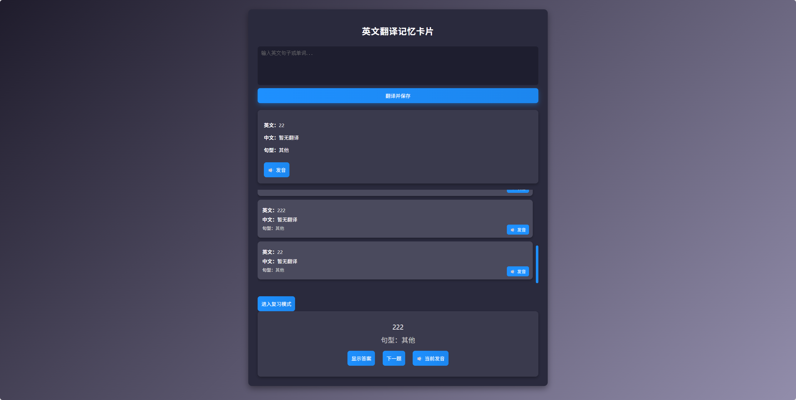

# English Translator

一个简单的英文翻译助手扩展，专为 Visual Studio Code 设计。它允许你在编辑器中快速将英文文本翻译成中文，并支持保存常用句子。



## 🧩 功能特性

| 特性 | 描述 |
|------|------|
| ✅ 翻译功能 | 支持选中文本一键翻译 |
| 💬 快捷访问 | 支持命令面板和右键菜单调用 |
| 💾 句子收藏 | 可保存常用句子供后续查阅 |
| 📚 历史记录 | 查看所有翻译过的句子 |

## 📦 安装方法

1. 打开 [VS Code Marketplace](https://marketplace.visualstudio.com/vscode)
2. 搜索 `English Translator`
3. 点击【Install】按钮进行安装
4. 重启 VS Code 后即可使用

## 🛠 使用说明

1. 在编辑器中选择任意英文文本
2. 右键点击并选择 `Open Translation Panel`
   或使用快捷键 `Ctrl+Shift+P` 并运行命令 `Open Translation Panel`
3. 翻译结果将在 Webview 面板中显示
4. 点击“保存”可将当前句子加入历史记录

## ⚙️ 设置说明

本插件会将翻译历史保存在以下配置项中：

```json
"languageLearning.history"
你可以在 VS Code 的设置中查看或清空历史记录。

🖼 截图预览
Translation Panel

🔍 提示：请将你的插件界面截图命名为 translation-panel.png，并放在 src/webview/images/ 目录下以正确显示。

📁 项目结构
english-translator/
├── dist/                     # 编译后的插件主文件
├── src/
│   ├── extension.ts          # 插件主逻辑（TypeScript）
│   └── webview/
│       ├── index.html        # Webview UI 主界面
│       └── main.js           # Webview 前端交互脚本
├── package.json              # 插件元信息与依赖配置
└── README.md                 # 当前文档
📝 开发者指南
构建插件
bash
npm run compile    # 编译 TypeScript
npm run package    # 打包插件
运行测试
bash
npm run test
调试插件
打开项目根目录。 按下 F5 或点击调试侧边栏中的 "Run Extension"。 新窗口将加载插件，可以实时调试。

📜 协议
MIT © [Your Name]

❓ 问题反馈 如果你在使用过程中遇到任何问题，欢迎提交 issue 到 GitHub 仓库，或者联系我进行修复。